## Quaternion vs [[arcball]] vs [[matrices]]

### Arcball, we said:
- start vector = where the mouse touched the sphere
- end vector = where the mouse dragged to
- rotation axis = cross product 
- roatation angle = arccos(dot product)
A quaternion 
$$
q = (x, y, z, w)
$$
is basically a **compressed package of** => `rotate around this axis by this angle` 
- `(x,y,z)` -> axis of rotation (normalized)
- `w` -> angle info
So instead of stacking trig functions and matrices, we just compose quaternions -> multiply them together (cheap and stable)

---
### 3. Quaternion in FDF (how we would use it)
We need to think th emapt as just a bunch of 3D points (x,y,z). To rotate them smoothly:
1. Store the current oritentation of the map as a quaternion.
2. When the user moves the mouse (like arcball), computes a new quaternion from that motion.
3. multiply it with the current oritentation quaternion
4. convert that quaternin to a 3x3 ( or 4x4) rotation matrix
5. Apply it to all our points before projecting to 2D


    ```c
    typedef struct s_quat {
    double w;
    double x;
    double y;
    double z;
}   t_quat;

t_quat quat_from_axis_angle(double ax, double ay, double az, double angle) {
    t_quat q;
    double s = sin(angle / 2.0);
    q.w = cos(angle / 2.0);
    q.x = ax * s;
    q.y = ay * s;
    q.z = az * s;
    return q;
}

t_quat quat_mul(t_quat a, t_quat b) {
    t_quat r;
    r.w = a.w*b.w - a.x*b.x - a.y*b.y - a.z*b.z;
    r.x = a.w*b.x + a.x*b.w + a.y*b.z - a.z*b.y;
    r.y = a.w*b.y - a.x*b.z + a.y*b.w + a.z*b.x;
    r.z = a.w*b.z + a.x*b.y - a.y*b.x + a.z*b.w;
    return r;
}

void quat_to_matrix(t_quat q, double m[3][3]) {
    double xx = q.x*q.x;
    double yy = q.y*q.y;
    double zz = q.z*q.z;
    double xy = q.x*q.y;
    double xz = q.x*q.z;
    double yz = q.y*q.z;
    double wx = q.w*q.x;
    double wy = q.w*q.y;
    double wz = q.w*q.z;

    m[0][0] = 1.0 - 2.0 * (yy + zz);
    m[0][1] = 2.0 * (xy - wz);
    m[0][2] = 2.0 * (xz + wy);

    m[1][0] = 2.0 * (xy + wz);
    m[1][1] = 1.0 - 2.0 * (xx + zz);
    m[1][2] = 2.0 * (yz - wx);

    m[2][0] = 2.0 * (xz - wy);
    m[2][1] = 2.0 * (yz + wx);
    m[2][2] = 1.0 - 2.0 * (xx + yy);
}
```

then, for each point (x,y,z) in our FDF map:
```c
newX = m[0][0]*X + m[0][1]*Y + m[0][2]*Z;
newY = m[1][0]*X + m[1][1]*Y + m[1][2]*Z;
newZ = m[2][0]*X + m[2][1]*Y + m[2][2]*Z;
```

that's our rotated point -> then apply isometric projection

```mermaid
	flowchart TD
    A[Mouse Drag] --> B[Compute Start & End Vectors on Virtual Sphere]
    B --> C[Find Rotation Axis Cross Product]
    B --> D[Find Rotation Angle arccos Dot Product]
    C & D --> E[Build Quaternion axis + angle]
    E --> F[Combine with Current Orientation Quaternion]
    F --> G[Convert Quaternion → Rotation Matrix]
    G --> H[Apply Matrix to Each 3D Point in FdF Map]
    H --> I[Project Rotated Points to 2D Isometric/Parallel]
    I --> J[Draw Wireframe Map on Screen]

```





